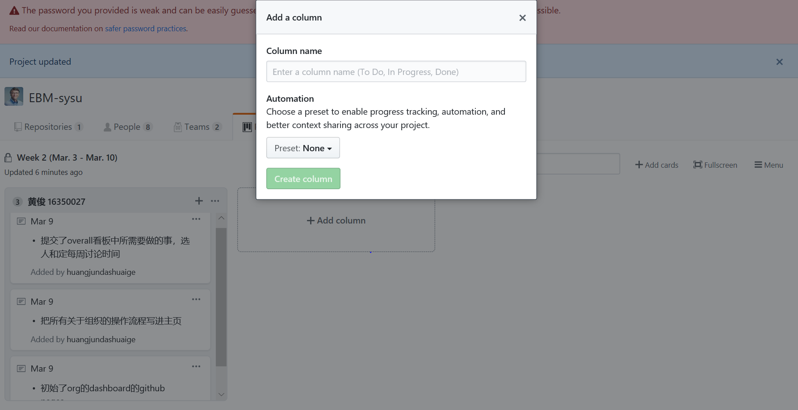
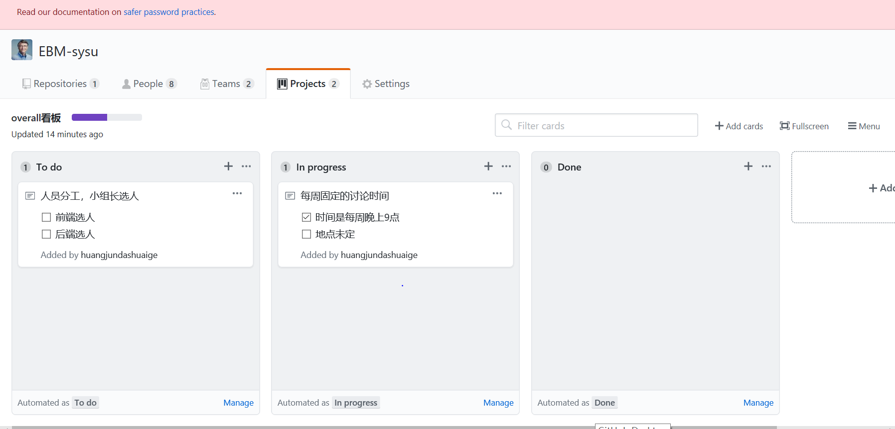

## 课程检查的要求

1. 维护好每一周的周报里的自己所做的事的column

因为老师最后要看的是整个项目是不是有一个长期的合作和实现的过程，所以追溯整个过程很重要的就是看是不是有在org的projects中（也就是看板）中留着自己所做的事。

其中有两个看板需要维护，一个就是周报的看报，也就是每一周就新开一个看报，其中每一个成员都需要在看板里面新建自己的column，并且把自己一周都干了的事写每一件事写一个card加入到自己的column中。

 

 2. 每周都关注一下overall看板中所需要做的事

 因为这一个看板是属于整个组织的，所以其中列出来的事都是和整个组织要做的事有关，比如选用什么架构啥的，具体的issue还是放在repo里面的看板比较好，说到底还是给最后老师检查的嘛。

 其中涉及到的操作就是如果自己想做里面的事，就把里面的card移动到in process里面，做完了就拉到done里面。

 