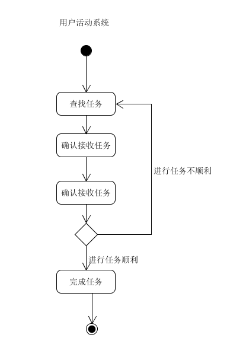
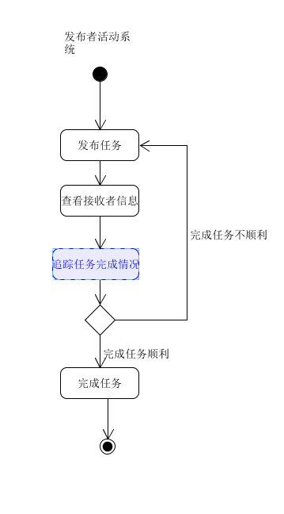

# 用例图
下图为整个系统的用例一览。

# 用例文本与活动图
整个系统按照业务划分为下面几个用例，用例文本引用了子用例图，并添有必要的活动图辅助说明。
**基本用例：**
 -  [注册登录](register_login.md)：注册登陆功能分成对于一般用户和发布者不同，为了确保安全性，需要对于发布者身份进行审核。
 -  [任务管理](manage_dishes.md)：查看任务的完成情况，其中完成情况由接收者提交，由发布者审核是否完成。
 -  [交易发生](operate_order.md)：所有交易都有系统担保，即发布者发布任务时把工资全部寄托在系统，确认完成后由系统统一发放。
 ---
 -  [接收任务](make_order.md)：涉及到任务的展示和内容展示。
 -  [任务内容修改](customer_history_order.md)：对于任务内容可以以问卷形式。

下面是活动图。

