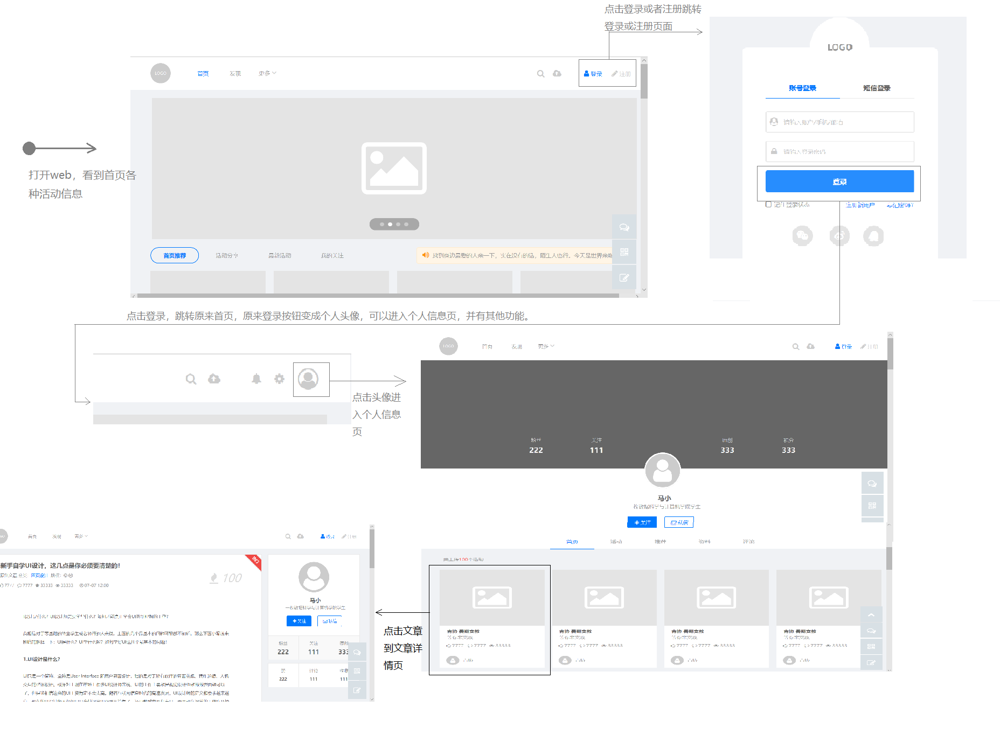
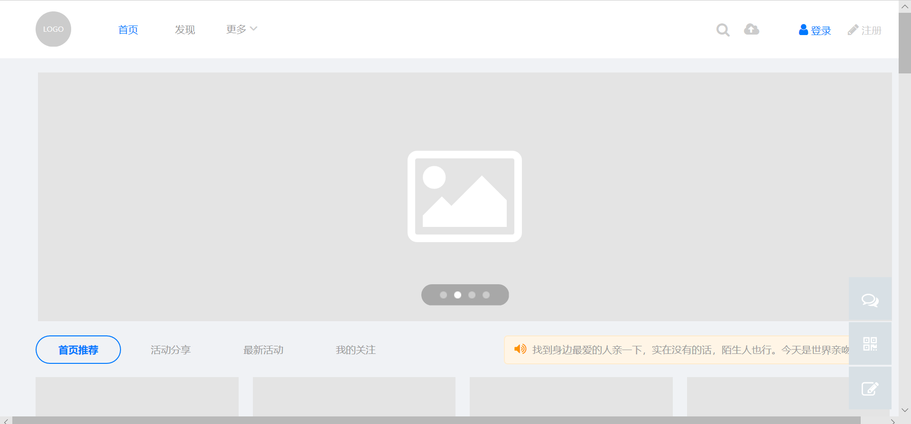
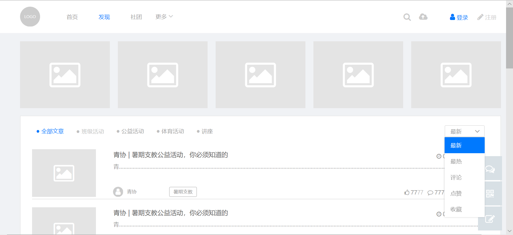
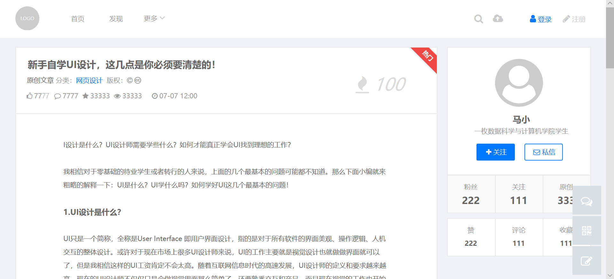
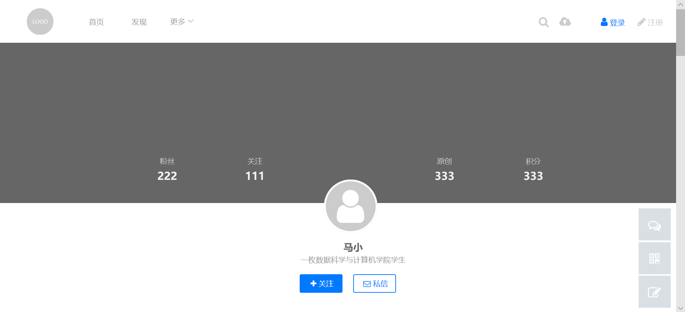
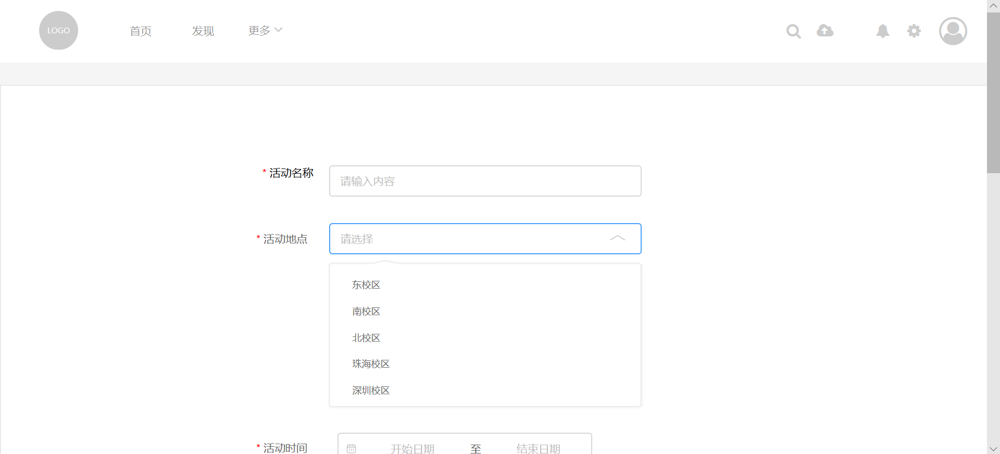
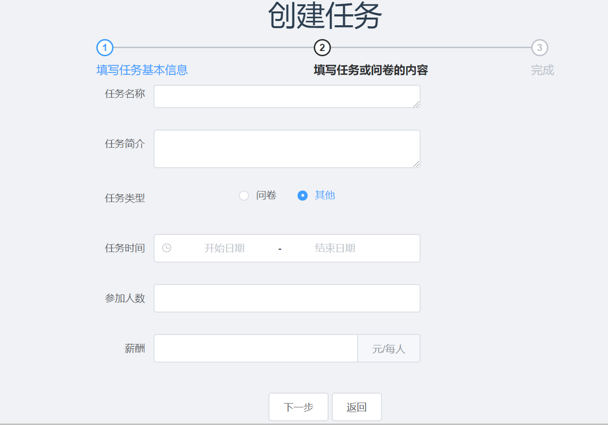
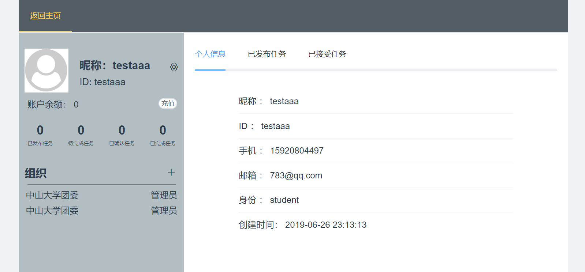

# UI Design

## Use case 1

---

## Version 0.1 (Week 3 ~ Week 8)

### 总览

第一版设计思路主要如下
- 逻辑上按照现有常见的社交功能平台设计思路，对现有活动进行分类，并将热门活动在首页展示出来。每个对应有详情页面，可以选择加入活动等。能有用户登录注册功能，对每个用户，有用户详情页可以对其进行管理。这个的主要功能思路
  1. 登陆注册用户
  2. 选择喜欢的活动
  3. 查看活动详情，并选择参加或不参加
  4. 点击个人头像，在个人详情页面可以看到已加入和已发布的任务
- 视觉效果上，采用顶部导航栏的形式，将各个功能的页面结合在一起，同时又能方便用户快速定位功能点。在主页的设计上，采用了和现在大众的社交网络类似的布局，使用web前端中element-ui和fontawesome的元素和icon，利用卡片的布局方式，设计了各个活动排列的方式。在个人主页也是一种常用社交风格、element-ui配色方案设计的。这样的设计适应了大多数人的使用习惯，也能让各个页面之间的逻辑关系比较清晰的排列出来。用element-ui的风格，能在ui上比较简洁方便，主页走马灯的设计，也能比较好的适应热点活动的功能需求。

整个web页面在设计视觉效果上可以有大概一下四个不同的页面：

1. 主页面  
  用走马灯的形式展示最热的活动功能，用卡片的形式展示全部活动，用导航栏的形式链接各个页面和各个功能。  
     
    

2. 活动详情页   
  用左右页面设计的形式，区别活动详情和发起者信息。  
    

3. 个人页面  
   个人页面采用和普通社交网络的设计风格，用上下式的，上部分展示个人基本信息，下部分展示与其有关的全部活动。  
     

4. 创建活动或调查页面  
  这部分和一般的调查问卷的页面类似，不过结合需求，暂时使用固定题型的形式发布和创建。  
  

### 组件设计思路

1. 活动卡片。类别卡片采用占据一行排列，展示活动的
2. 个人页面陈列，将次要的数据信息放到了和头像平齐的地方，而将重要的参与活动信息放到了大块的下方，这样能突出重点。
3. 信息陈列上，主要信息会突出于底层。这里用了颜色或者边框阴影进行突出。每个部分有相应的大标题来指引

### 自评

1. 逻辑较为清晰，界面不太拥挤
2. 导航栏的设计能让全部功能更好的结合在一起，而且这也符合element-ui的设计风格
3. 设计语模块不太同一，个人页面和其他页面的风格不太一致，不是选择用卡片式展现

## Version 0.2 (Week 8 ~ Now)

### 总览

根据上一版本的思考之后，为了解决填写问卷的时候能增加用户需要的提醒，所以需要对活动发布的页面进行改进。同时为了让个人页面和活动详情页能在整体上风格更加的一致，所以将个人页面的布局从上下分割改成了左右分割。  
1. 将原来发布活动的页面从简陋的固定题型发布改成了可以选择题型的形式，让这个页面中的功能更能适应比较多的活动需求  
     

2. 为了让个人页面和活动详情页面能有比较统一的风格，在这版里面稍微的改动了一下个人页面的布局，将上下界面划分这种方法改成了左右划分。  
   

