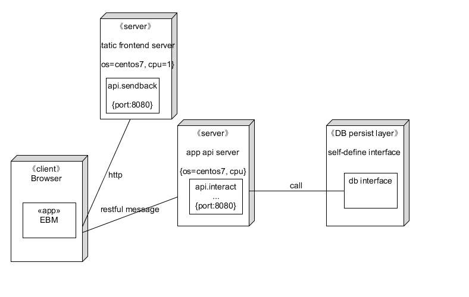

##  2. 技术选型
###  2.1. client端
可选的技术选型及其选择理由分析
- 前端框架

  - Vue

    Vue是一套用于构建用户界面的渐进式框架，可以自底向上逐层应用。Vue容易上手，便于与第三方库整合（例如element-ui），另外Vue是中国开发的前端框架，官方文档全中文，便于学习使用，另外开发人员之前有学习过Vue，所以采用Vue来搭建前端是最合理的选择。

  - element-ui

    element-ui是一个与Vue兼容的桌面端组件库，该组件库中包含众多网站开发中常用的控件，如下拉菜单，导航栏，进度条等等，官网上每个例子后面都有实现代码，方便易用，而且这些控件UI十分优美，可以极大地提高用户体验。

  - jQuery

    jQuery的重要性不言而喻，控制页面组建的最方便的js包。在前端开发的过程中，将jQuery嵌入到了Vue中，加速了前端页面的开发。

###  2.2. server端
可选的技术选型及其选择理由分析

- 后端框架
  - nodejs
    选用nodejs达到前后端一致，减少可能会出现的语言支持不一致导致的坑。并且因为这次的项目并不是一个计算密集的项目，所以没必要考虑分布式服务，nodejs在性能上足够达成需求。
  - go
    高性能，对于中间件支持较好，但是因为这是一个团队项目，贸然使用一个大家熟练程度不同的技术栈最严重的后果就是因为熟练程度不同导致部分同学编程bug生成机器，写的bug比写的task还更多，平白无故耗费其他同学的精力，对于项目的效率来说是一个负提升。
  - django
    后端数据库二合一，小白学习后端第一个应该学的后端框架，虽然说简单但是还是因为和go一样的原因导致不被采用。

所以我们后端框架选择的是nodejs作为大家开发的统一框架。

- 后台服务支持
  没什么好说的，Nginx，傻瓜式操作。

- 数据库DBMS
  - sql
    最常用的数据库DBMS类型，优化好效率高，只能对大数据量低并发的不二之选，因为上过数据库的课所以大家都会用。
  - nosql
    现在web架构必不可少的分布式数据库DBMS，一句话问就是分布式，针对对于上锁频率不高的服务来说非常完美，相对于sql的时候可操作性更大。
    
  但是还是因为效率负提升的考虑，最后还是选用了mysql作为数据库的技术栈。
- 额外的技术支持
  - docker
    容器化服务，即插即用的特性

##  3. 软件架构设计

###  3.1. 1. 软件架构的逻辑视图

架构是前后端分离，前端发放服务器和后端交互服务器分离，其中用restful-like api进行交互。用mysql作为持久化层。

前端的模式为mvc模式，其中使用到的外部支持库有编辑调查表的survey.js

###  3.2. 2. 软件架构的物理视图

架构的物理层架构，分别分成了前端用户的浏览器访问端，从静态服务器中获取前端文件，用restful的方式从api服务器去进行交互，其中涉及到持久层的交互由与mysql dbrs完成。

