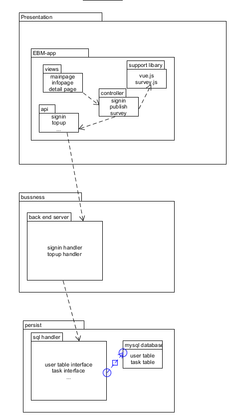

##  6. 软件架构设计

###  6.1. 1. 软件架构的逻辑视图

架构是前后端分离，前端发放服务器和后端交互服务器分离，其中用restful-like api进行交互。用mysql作为持久化层。

前端的模式为mvc模式，其中使用到的外部支持库有编辑调查表的survey.js

###  6.2. 2. 软件架构的物理视图

架构的物理层架构，分别分成了前端用户的浏览器访问端，从静态服务器中获取前端文件，用restful的方式从api服务器去进行交互，其中涉及到持久层的交互由与mysql dbrs完成。

