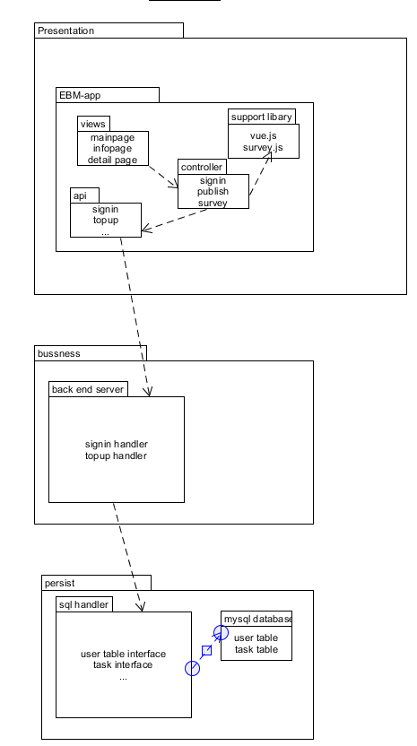

###  6.1. 1. 软件架构的逻辑视图

架构是前后端分离，前端发放服务器和后端交互服务器分离，其中用restful-like api进行交互。用mysql作为持久化层。

前端的模式为mvc模式，其中使用到的外部支持库有编辑调查表的survey.js

#### 前端文件目录

- front-end
  - build:  webpack文件，配置参数,打包的代码存放在这里，自动生成
  - config:  vue项目的基本配置文件，自动生成
  - node_modules: 存放项目中使用的各种npm包，cnpm/npm install后生成
  - src: 项目源文件存放地址，包含前端页面，路径配置，静态资源等
    - assets：存放前端页面用到的各种静态资源
    - components：存放前端的各个vue页面
    - router：存放前端页面的路径配置文件
    - App.vue：VUE demo演示页面的启动组件
    - main.js：该模块页面的初始化js
  - static：项目静态资源目录
  - test：测试文件，初始化测试都写在这里,可以删除
  - .babelrc ：babel编译参数，vue开发需要babel编译
  - .editorconfig：代码编辑环境配置文件
  - .gitignore：设置git忽略文件
  - .postcssrc.js：css配置文件,自动补齐浏览器css前缀
  - index.html：主页，项目入口文件
  - package.json：项目配置文件，描述项目信息和依赖
  - README.md ：项目的说明文档，markdown 格式
  - run.bat：Windows批处理文件，运行项目时生成

  # 后端源码目录以及说明
## 项目代码  
https://github.com/whatsup-sysu/Backend

## 代码说明
- src
  - bin: 执行程序
  - controllor:  控制器目录
    - DBController_public.js:数据库接口
    - userSystem_public.js:用户系统，登录注册等
    - dutySystem_public.js:任务系统，发布接受等
    - tradeSystem_public.js:交易系统，转账充值等
    - surveySystem_public.js:问卷调查相关
    - imageSystem_public.js:图片资源上传下载
    - utils_public:公共模块
    - validator.js:正则校验
  - database: 数据库管理
    - Config：数据表及配置信息
    - DataBaseMySQL：数据库连接管理
  - routes：路由分级处理
    - users.js 
    - dities.js
    - photo.js
    - survey.js
    - trades.js
    - survey.js
  - sessions：保存后端与前端的会话状态
  - upload：保存用户上传的资源信息
  - app.js ：express程序执行入口
  - package.json：项目配置文件，描述项目信息和依赖

## 测试文档  
附文件《后端API测试报告》
