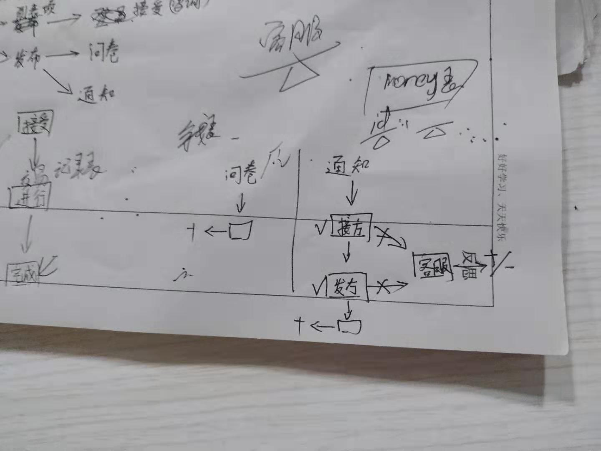

## 会议讨论的问题

1. 前后端技术栈

前端使用vue，在之后的迭代中考虑安卓支持的web组件。
后端使用express。
数据库交互使用mysql。

2. 需求分析

具体应该能够支持的服务和功能。

3. 页面交互分析

应该有几个页面，分别能够支持什么样的交互。

4. 实现大体分析

数据库应该如何存储。怎么划分不同的表。

### 需求分析

1. 界面划分

- 分成四个界面，分别是登陆界面，任务列表页面，任务详情页面，个人信息页面

- 登陆界面提供了基础的登陆功能，账号建立功能。

- 任务列表页面提供了所有已经发布的任务，其中提供的功能分别有个性化推荐和按照不同参数来排序（可能是按照发布时间、收益的多少）。

- 任务详情界面就是选定了任务列表中的任务，会跳转到对应的任务详情页面，其中有对于任务的详细要求的描述和个人与任务交互的任务。

- 个人信息页面就是可以对于个人信息和历史信息以及虚拟代币的管理界面。

### 界面交互分析

- 登陆界面，输入账户和密码访问数据库，确认之后跳转到任务列表页面

- 任务列表页面相当于是主界面，其中可以跳转到个人信息的模块（通过侧边栏），还可以跳转到任务发布页面（通过按钮）

- 个人信息模块，可以跳转到账户余额界面

- 账号余额界面

- 任务详情页面可以跳转到接受页面

### 数据库存储规划

- 个人账号

- 总的任务列表

- 账号余额表

- 交易记录表

### 交易逻辑

