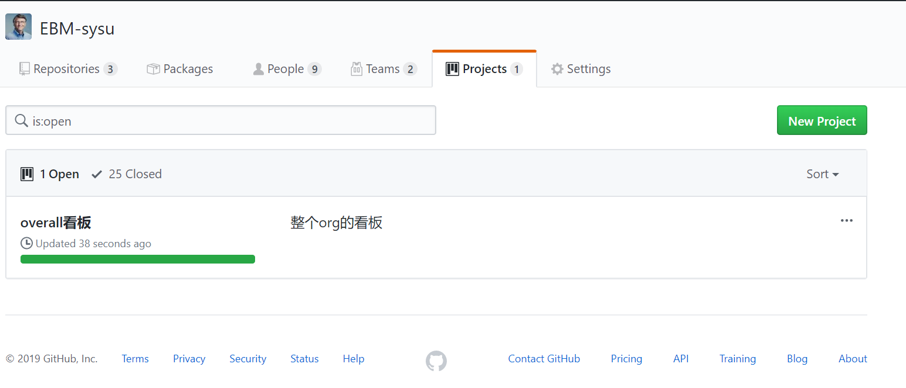
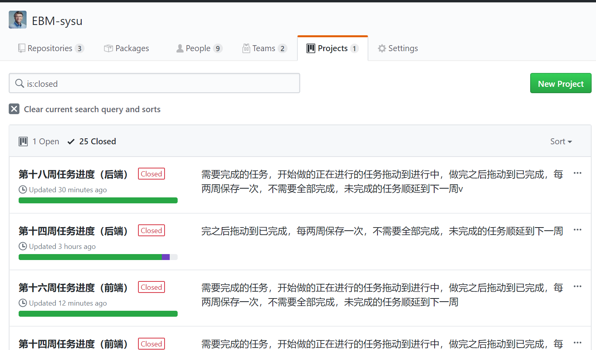
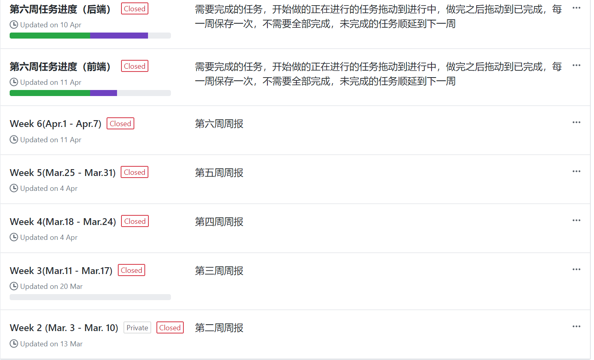
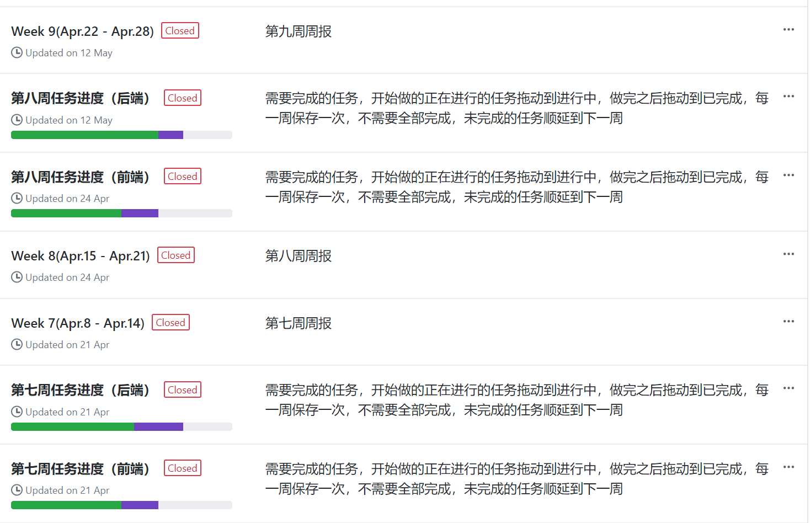
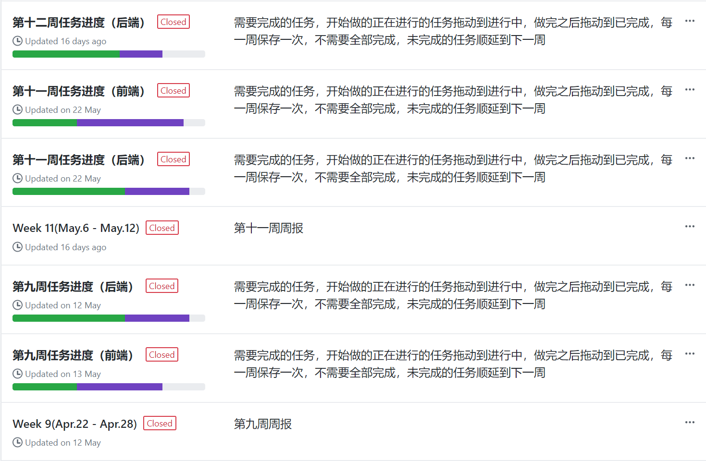
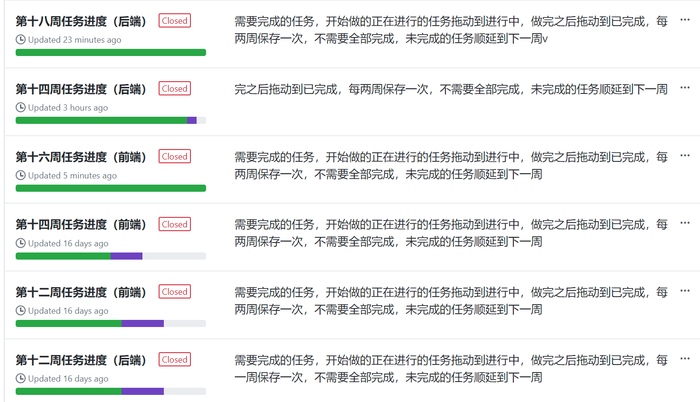
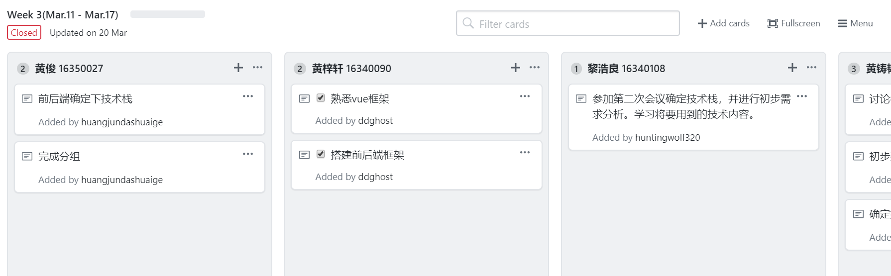
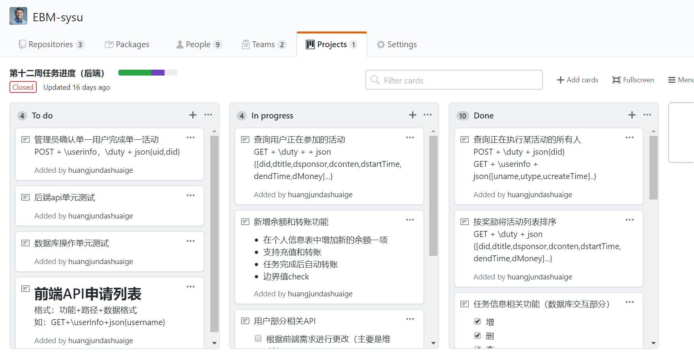
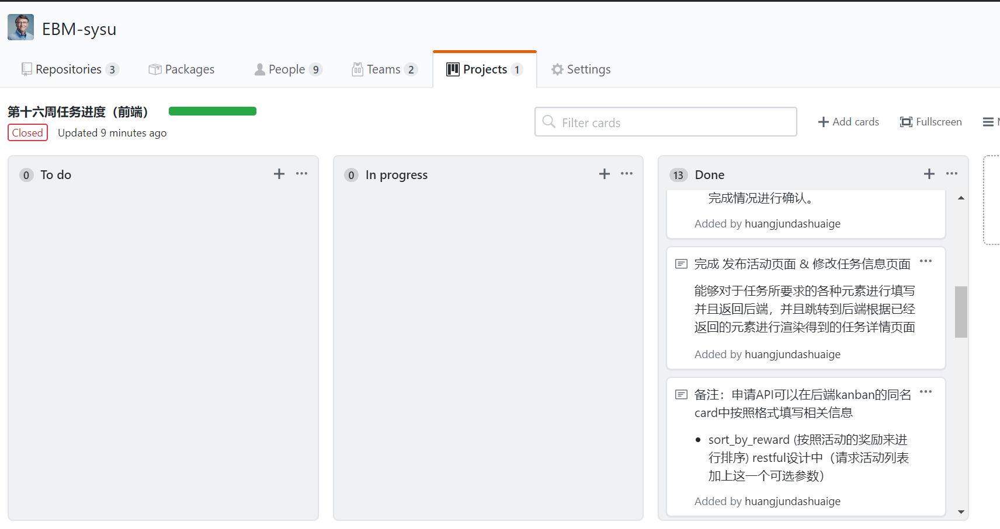

## KANBAN情况分析

### 看板整体情况

可以看到我们一共有26个看板记录，其中分成两类，一类是用来放比如说团队分人，迭代记录等涉及到整个团队的任务，一个是每周的周报也就是所有要完成的小任务，具体分成前端和后端方便协作和追查进度。

### 看板持续时间分析

可以看到我们的看板记录从第二周开始一直保持到了16/18周。见证了我们项目长久的开发经过。

### 具体看板内容分析

一开始我们采用的记录的方法和课程要求还是有区别的，是通过每个人来建立自己的column来发布和记录任务。

之后就采取了和课程一样的每周积累的方式，完成的就加入到done，未完成的累计到下一周，这么做可以更好看出任务的完成度。

我们任务也就从最开始的todo最多一步步到所有都被完成。